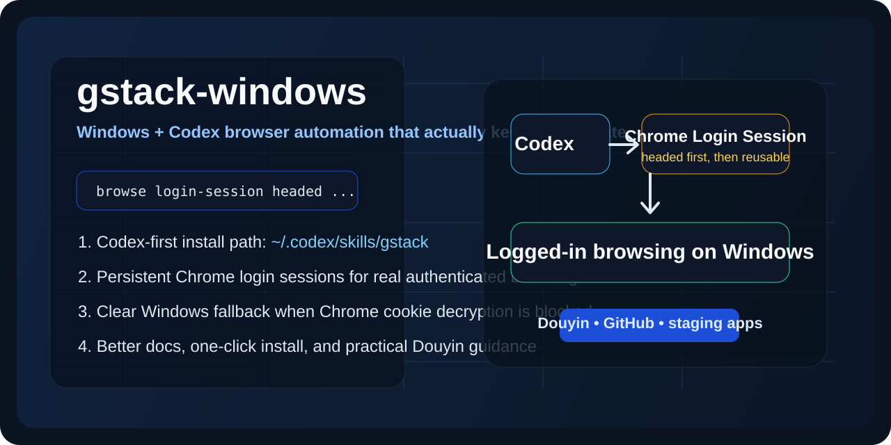
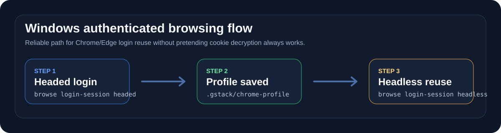

# gstack-windows

[](https://github.com/xiaoliangliang/gstack-windows/releases)
[](https://github.com/xiaoliangliang/gstack-windows/actions/workflows/ci.yml)
[](https://github.com/xiaoliangliang/gstack-windows/actions/workflows/skill-docs.yml)
[](LICENSE)



**Make Codex browse logged-in Windows sites without fighting Chrome cookie encryption.**

`gstack-windows` is a Windows + Codex focused fork of [gstack](https://github.com/garrytan/gstack). It keeps the original fast browser automation and slash-skill workflow, but reshapes the experience around the thing Windows users actually need: a reliable path to authenticated browsing.

## Why This Fork Exists

On modern Windows setups, Chrome and Edge may protect default-profile cookies with app-bound encryption. That means a lot of “import your real browser cookies” tooling becomes unreliable right where people need it most.

This repo takes a more practical approach:

- prefer `~/.codex/skills/gstack`
- keep direct cookie import when it works
- make persistent Chrome login sessions the first-class Windows auth story
- explain limitations clearly instead of pretending everything imported fine

## 90-Second Quickstart

### 1. Install globally for Codex

From a local checkout:

```powershell
powershell -ExecutionPolicy Bypass -File .\install-codex-global.ps1
```

### 2. Verify your environment

```powershell
powershell -ExecutionPolicy Bypass -File "$env:USERPROFILE\.codex\skills\gstack\doctor.ps1"
```

### 3. Create a persistent logged-in session

```powershell
browse login-session headed https://www.douyin.com/
```

Log in manually once, then switch to:

```powershell
browse login-session headless
```

Now normal `browse` commands reuse that login state.

## The 5-Minute Win

Inside any project repo:

```powershell
browse login-session headed https://www.douyin.com/
```

Sign in once in the opened browser window, then:

```powershell
browse login-session headless
browse goto https://www.douyin.com/
browse snapshot -i
browse screenshot
```

Your saved login profile lives in `./.gstack/chrome-profile` for that project, and `.gstack/` is auto-added to `.gitignore`.

## Why People Will Prefer This Over Upstream

| Area | Upstream gstack | gstack-windows |
|------|------------------|----------------|
| Primary install path | Claude-oriented | Codex-first: `~/.codex/skills/gstack` |
| Windows docs | Partial | Windows-first quickstart and troubleshooting |
| Authenticated browsing on Windows | Cookie import framing | Persistent Chrome login-session framing |
| Chrome/Edge encryption limitations | Easy to miss | Called out explicitly with recommended fallback |
| One-step global install | Manual clone + setup | `install-codex-global.ps1` |
| Existing upstream install migration | Manual | installer can repoint an existing global install to this fork |
| Environment diagnosis | Manual | `doctor.ps1` |
| Public repo polish | Generic fork feel | release, topics, templates, docs, CI |

## What Works Especially Well

- `/browse` for navigation, screenshots, DOM inspection, forms, uploads, console logs, and network debugging
- `/setup-browser-cookies` when direct Chromium cookie import is possible
- `browse login-session headed|headless|status|stop` for persistent authenticated browsing
- `/qa`, `/qa-only`, `/qa-design-review`, `/review`, `/ship`, and the planning skills
- mixed PowerShell + Git Bash workflows inside Codex

## The Main Windows Auth Strategy

For sites where default-profile cookie import is blocked, the recommended path is:

```powershell
browse login-session headed https://target-site.com/
```



Then:

1. Sign in manually in the real browser window
2. Confirm the session is stable
3. Reuse it headlessly:

```powershell
browse login-session headless
```

This is the best default for:

- Douyin
- GitHub
- internal staging environments
- dashboards that require a stable authenticated browser context

## Where the Saved Session Lives

Persistent login sessions are project-local instead of hiding in a random temp folder:

- profile: `.gstack/chrome-profile`
- launch config: `.gstack/browse-launch.json`
- logs and runtime state: `.gstack/`
- git safety: `.gstack/` is auto-added to `.gitignore`

That makes the workflow easier to trust, easier to inspect, and much easier to clean up.

## Direct Cookie Import

If the source profile is decryptable, direct cookie import still works:

```powershell
browse cookie-import-browser
```

Or:

```powershell
browse cookie-import-browser chrome --domain douyin.com
```

If Windows reports a decryption limitation, switch to the persistent login-session flow instead.

## Important Limitations

- This repo cannot magically decrypt every Chrome or Edge default profile on Windows
- CAPTCHA, WebAuthn, SMS login, or stronger anti-bot controls may still require a manual step
- Douyin usually works best with `login-session headed` as the first step
- This project does **not** bypass anti-bot systems; it preserves a legitimate user-created login state for Codex automation

## Install Options

### Global install

```powershell
git clone https://github.com/xiaoliangliang/gstack-windows.git "$env:USERPROFILE\.codex\skills\gstack"
powershell -ExecutionPolicy Bypass -File "$env:USERPROFILE\.codex\skills\gstack\setup.ps1"
```

### Project-vendored install

```powershell
New-Item -ItemType Directory -Force -Path ".codex\skills" | Out-Null
Copy-Item "$env:USERPROFILE\.codex\skills\gstack" ".codex\skills\gstack" -Recurse -Force
powershell -ExecutionPolicy Bypass -File ".codex\skills\gstack\setup.ps1"
```

## Main Skills

- `/browse`
- `/setup-browser-cookies`
- `/qa`
- `/qa-only`
- `/qa-design-review`
- `/plan-ceo-review`
- `/plan-eng-review`
- `/plan-design-review`
- `/design-consultation`
- `/review`
- `/ship`
- `/retro`
- `/document-release`
- `/gstack-upgrade`

## Documentation

- [Windows Quickstart](docs/QUICKSTART-WINDOWS.md)
- [Authenticated Browsing on Windows](docs/AUTHENTICATED-BROWSING.md)
- [Command Recipes](docs/COMMAND-RECIPES.md)
- [Windows Compatibility Matrix](docs/COMPATIBILITY-WINDOWS.md)
- [FAQ](docs/FAQ.md)
- [Windows Troubleshooting](docs/TROUBLESHOOTING-WINDOWS.md)
- [Browser Technical Details](BROWSER.md)

## Development

```bash
bun install
bun run gen:skill-docs
bun run skill:check
bun run test:smoke
```

Windows runtime rebuild:

```powershell
powershell -ExecutionPolicy Bypass -File .\setup.ps1
```

## Community

- [Contributing](CONTRIBUTING.md)
- [Security policy](SECURITY.md)
- [Support](SUPPORT.md)

## Search-Friendly Keywords

This repo is intentionally optimized to be discoverable for searches like:

- `gstack windows`
- `codex browser automation windows`
- `chrome login session windows`
- `setup-browser-cookies windows`
- `app-bound cookie encryption codex`
- `douyin codex browser login state`

## Upstream Attribution

This project is based on [garrytan/gstack](https://github.com/garrytan/gstack) and keeps the original MIT license. The focus of this fork is Windows + Codex usability, especially authenticated browser automation and Chrome login-state reuse.
